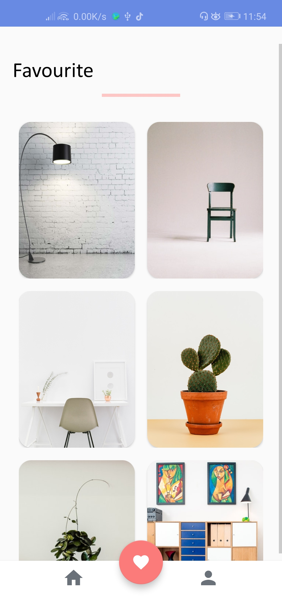

# FutureFurnitureUI-Android
Check out the new style for App Design aims for Furniture E-commerce...😉😀😁😎

## Screenshots

**Please click the image below to enlarge.**

## Contributing

Please fork this repository and contribute back using
[pull requests](https://github.com/vimalcvs/SushiApp).

Any contributions, large or small, major features, bug fixes, are welcomed and appreciated
but will be thoroughly reviewed .

### Contact - Let's become friend
- [Twitter](https://twitter.com/vimalvishwakar6)
- [Github](https://github.com/vimalcvs)
- [WhatsApp](https://wa.me/919792313278/)
- [Facebook](https://www.facebook.com/vimalcvs)

### Like our facebook page
- [Android UI's Bucket](https://www.facebook.com/vimalcvs)
